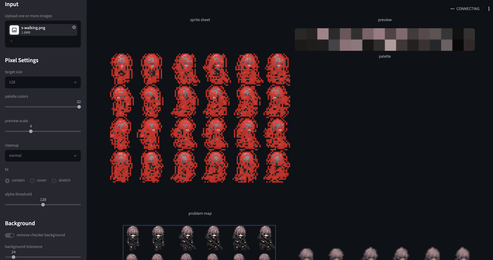
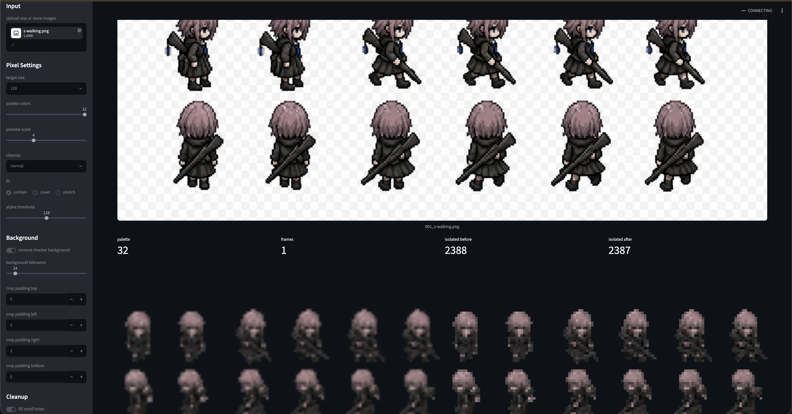
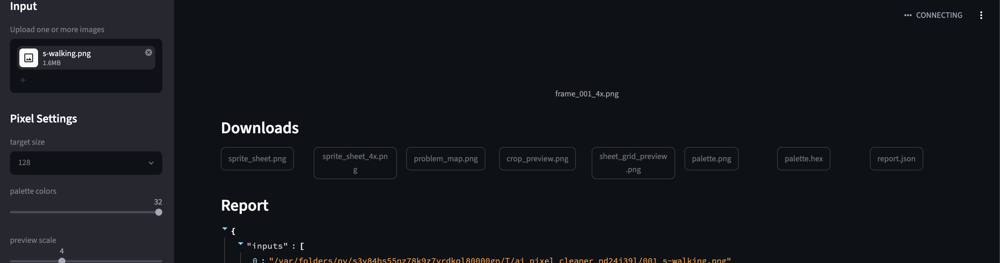

[English](../README.md)
# AIピクセルクリーナー

AIピクセルクリーナーは、AIが生成した画像を、低解像度で色数制限のある透明なスプライトシートに変換します。
Asepriteなどのツールで検査や修復が容易になります。

チェッカー模様の背景を除去し、アルファチャンネルを硬化させ、色数を減らし、
最終的にクリーンなPNGシートとして再構成します。

>  要約すると、AIで生成したドット絵って解像度が高かったりドットの欠損があったりと、ちょっと扱いづらのを扱いやすい視認性の落ちないレベルで解像度を下げて使えるAI画像向けのドット絵整理ツールです。
[スクリーンショット](##スクリーンショット)

## セットアップ
1. python/uvをインストールしてください
2. このスクリプトを実行してください
```sh
uv venv .venv
uv sync
```

## CLI

```sh
uv run ai-pixel-cleaner input.png --size 128 --colors 32 --cleanup normal
```

デフォルトの出力は `outputs/` に書き込まれます。

- `sprite_sheet.png`: 透明なスプライトシート
- `sprite_sheet_4x.png`: 最近傍プレビュー
- `crop_preview.png`: クロップとパディングオーバーレイのプレビュー
- `sheet_grid_preview.png`: 等分割フレームグリッドのプレビュー
- `frames/frame_001.png`: フレームごとの処理済みPNG
- `frames/frame_001_4x.png`: フレームごとのプレビュー
- `palette.png`: パレットスウォッチ
- `palette.hex`: パレットカラーの16進数値
- `problem_map.png`: 問題のある可能性のあるピクセルを赤色でオーバーレイ表示
- `report.json`: 機械可読な診断情報

便利なオプション:

```sh
uv run ai-pixel-cleaner input.png -o outputs/demo --size 96 --colors 24
uv run ai-pixel-cleaner input.png --fit cover --cleanup weak
uv run ai-pixel-cleaner input.png --no-outline-preserve --cleanup strong
uv run ai-pixel-cleaner input.png --sheet-columns 4 --sheet-padding 1
uv run ai-pixel-cleaner input.png --crop-pad-left 4 --crop-pad-top 2 --crop-pad-right 1 --crop-pad-bottom 2
```

## Web UI
```sh
uv venv .venv
uv sync
```


```sh
uv run streamlit run app.py
```

UIは複数アップロード、チェッカー背景除去、アルファチャンネルに対応していますクリーンアップ、スプライトシートのレイアウト、およびフレームごとのプレビュー。

## スクリーンショット




# LICENSE
[MIT](../LICENSE)
